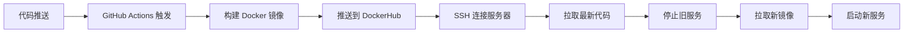

# GoMailAPI2 自动化部署指南

## 概述

本项目实现了基于 GitHub Actions 的自动化部署流程，当代码推送到主分支时，会自动构建 Docker 镜像、推送到 DockerHub，并在服务器上部署最新版本。

## 部署流程



## 配置步骤

### 1. GitHub Secrets 配置

在 GitHub 仓库的 Settings → Secrets and variables → Actions 中添加以下密钥：

- `DOCKERHUB_USERNAME`: DockerHub 用户名
- `DOCKERHUB_TOKEN`: DockerHub 访问令牌（在 DockerHub Account Settings → Security 中生成）
- `SERVER_HOST`: 服务器 IP 地址
- `SERVER_USER`: 服务器用户名（通常是 `ubuntu`）
- `SERVER_SSH_KEY`: 服务器 SSH 私钥

### 2. 服务器配置

#### 2.1 确保项目目录存在

```bash
mkdir -p /home/ubuntu/app/GoMailAPI2
cd /home/ubuntu/app/GoMailAPI2
git clone <your-repo-url> .
```

#### 2.2 设置部署脚本权限

```bash
chmod +x deploy.sh
```

#### 2.3 确保 Docker 和 Docker Compose 已安装

```bash
# 检查 Docker
docker --version

# 检查 Docker Compose
docker compose version
```

### 3. SSH 密钥配置

#### 3.1 生成 SSH 密钥对（如果还没有）

```bash
ssh-keygen -t rsa -b 4096 -C "deploy@gomailapi2"
```

#### 3.2 将公钥添加到服务器

```bash
cat ~/.ssh/id_rsa.pub >> ~/.ssh/authorized_keys
```

#### 3.3 将私钥内容复制到 GitHub Secrets 中的 `SERVER_SSH_KEY`

## 文件说明

### 核心文件

- `.github/workflows/deploy.yml`: GitHub Actions 工作流配置
- `compose.prod.yaml`: 生产环境 Docker Compose 配置
- `deploy.sh`: 服务器端部署脚本
- `build-and-push.ps1`: 本地构建和推送脚本（保留作为备用）

### 环境配置

- **开发环境**: 使用 `compose.yaml`（本地构建）
- **生产环境**: 使用 `compose.prod.yaml`（拉取镜像）

## 使用方法

### 自动部署

1. 修改代码
2. 提交并推送到 `main` 或 `master` 分支
3. GitHub Actions 自动触发部署流程
4. 检查 Actions 页面查看部署状态

### 手动部署

```bash
# 在服务器上运行
cd /home/ubuntu/app/GoMailAPI2
./deploy.sh
```

### 手动触发 GitHub Actions

1. 在 GitHub 仓库页面点击 "Actions"
2. 选择 "Build and Deploy" 工作流
3. 点击 "Run workflow"

## 监控和日志

### 查看服务状态

```bash
cd /home/ubuntu/app/GoMailAPI2
docker compose -f compose.prod.yaml ps
```

### 查看实时日志

```bash
docker compose -f compose.prod.yaml logs -f
```

### 查看服务健康状态

```bash
docker compose -f compose.prod.yaml exec server curl -f http://localhost:8080/health
```

## 故障排除

### 常见问题

1. **镜像拉取失败**

   - 检查网络连接
   - 验证 DockerHub 镜像是否存在

2. **SSH 连接失败**

   - 验证服务器 IP 和用户名
   - 检查 SSH 密钥格式

3. **服务启动失败**
   - 检查配置文件是否正确
   - 查看容器日志排查问题

### 回滚操作

```bash
# 如果新版本有问题，可以回滚到之前的镜像
docker compose -f compose.prod.yaml down
docker run -d --name gomailapi2-server -p 8080:8080 -p 50051:50051 mufeng888/gomailapi2-server:previous-tag
```

## 优化建议

1. **使用镜像标签**: 考虑使用版本标签而不是 `latest`
2. **蓝绿部署**: 对于零停机部署，可以考虑蓝绿部署策略
3. **监控告警**: 集成监控系统（如 Prometheus + Grafana）
4. **备份策略**: 定期备份配置文件和数据

## 安全注意事项

1. 定期轮换 SSH 密钥和 DockerHub 令牌
2. 使用最小权限原则配置服务器用户
3. 定期更新 Docker 和系统安全补丁
4. 考虑使用 VPN 或防火墙限制服务器访问
